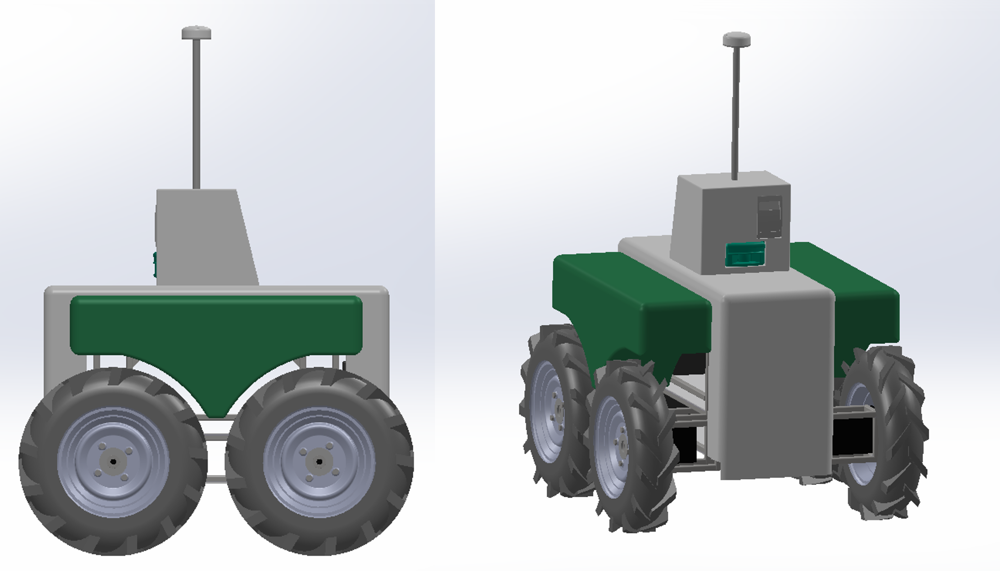

# VineScoutCAD
This repository contains CAD files for the VineScout mobile robotic platform. It includes both individual and assembled components in Autodesk Inventor 2024 and SolidWorks 2022 formats.

## Inventor Files
- Individual Parts: Located in the Inventor folder. The main assembly file is 'parts.iam', which includes all individual components.

## SolidWorks Files
- Assembled Parts: Located in the SolidWorks folder. The main assembly file is 'vinescout.SLDASM', which includes the complete assembly of the robot.
